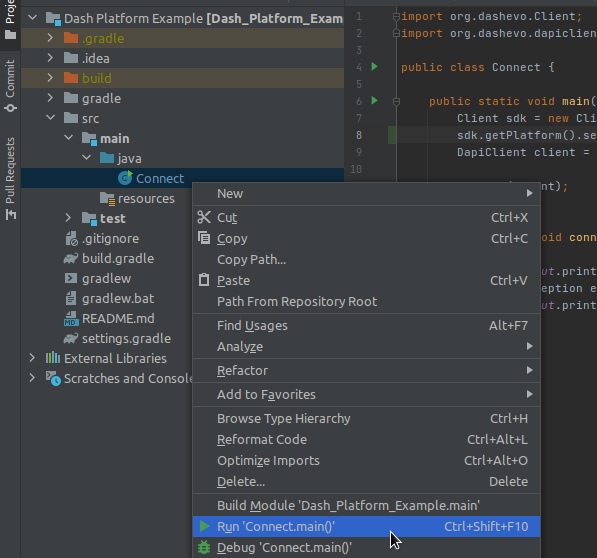

# Dash Platform Example (Java)

A minimal example Dash Platform project written in Java

This is intended more to show how to get the dependencies set up than cover
details of using them. Explore the dependency sources for more info - 
especially [android-dashpay](https://github.com/dashevo/android-dashpay).

## Table of Contents

- [Install](#install)
- [Usage](#usage)
- [Creating your own project](#creating-your-own-project)

## Install

1. To build this project it is first necessary to build the dependencies as follows:

```bash
git clone -b master https://github.com/dashevo/android-dpp.git android-dpp
cd android-dpp
gradlew build
cd ..

git clone -b master https://github.com/dashevo/dapi-client-android dapi-client-android
cd dapi-client-android
gradlew build
cd ..

git clone -b master https://github.com/dashevo/android-dashpay.git android-dashpay
cd android-dashpay
gradlew build
cd ..

git clone https://github.com/dashevo/dashj.git dashj
cd dashj
mvn clean install -DskipTests
cd ..
```

2. Install [IntelliJ IDEA](https://www.jetbrains.com/idea/)

## Usage 

To run the example, Right click the [src/main/java/Connect](./src/main/java/Connect.java)
file and select `Run 'Connect.main()'`. 



The output will show up in the `Run` Tool Window
and should include a response that may contain some debug info along with output similar to:

```text
> Task :Connect.main()
Connected. Best block hash: 000000ba933d66fe44708f3a987870489d1c9041f284e2465fdb8c7127458fc7
```

## Creating your own project

The following steps show how to start a new Dash Platform project using IntelliJ IDEA

### Create new project

Open IntelliJ IDEA and do the following:

1. `File`->`New Project`->`Gradle`
    - Under `Additional Libraries and Frameworks`, Select `Java` and click `Next`
1. Add `Name` and click `Finish`

### Setup dependencies

Add the following to the "repositories" section of `build.gradle` as shown in [this file](./build.gradle#L10):

```text
    maven { url 'https://s01.oss.sonatype.org/content/repositories/snapshots/'}
```

Add the following to the "dependencies" section of `build.gradle` as shown in [this file](./build.gradle#L17-L22):

```text
    implementation "org.dashj:dashj-core:0.18-SNAPSHOT"
    implementation 'org.dashj.platform:dashpay:0.19-SNAPSHOT'
    implementation 'org.dashj.platform:platform-core:0.19-SNAPSHOT'
    implementation 'org.dashj.platform:dpp:0.19-SNAPSHOT'
    implementation 'org.dashj.platform:dapi-client:0.19-SNAPSHOT'
    implementation 'org.slf4j:slf4j-jdk14:1.7.28'
```

### Add example

1. Right click `src/main/java` and select `New` -> `Java Class`
2. Copy the code from [src/main/java/Connect.java](./src/main/java/Connect.java) and paste it into the new file

To run your example, follow the details provided in the [Usage section](#usage).
